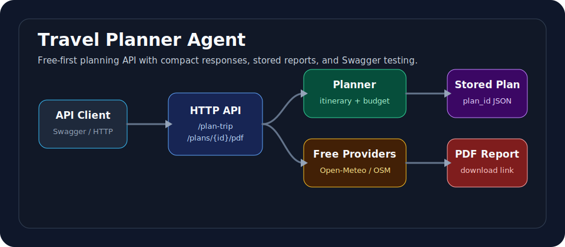

# 🧭 Travel Planner Agent API

Plan realistic trips from a simple JSON request. The API returns a short answer
for the user, stores the full plan by ID, and creates a downloadable PDF report.



## ✨ What It Does

- Builds budget, solo-backpacking, or family travel plans
- Supports any destination that can be found through free geocoding
- Uses free public data where possible: Open-Meteo and OpenStreetMap
- Adds hosted free-model reasoning through OpenRouter when configured
- Creates a `plan_id` for every completed trip
- Stores the full plan as JSON
- Generates a PDF report with a direct download endpoint
- Ships with Swagger UI for testing the API in a browser

## 🚀 Quick Start

```powershell
git clone https://github.com/khalilaln1/Ai-Agent-Traveling-Planner.git
cd Ai-Agent-Traveling-Planner
copy .env.example .env
python -m travel_agent.api --host 127.0.0.1 --port 8001
```

Open Swagger:

```text
http://127.0.0.1:8001/docs
```

Health check:

```text
http://127.0.0.1:8001/health
```

## 🔐 Configuration

The project works without paid APIs. For better reasoning, add a free OpenRouter
key to your local `.env` file:

```env
OPENROUTER_API_KEY=your_key_here
OPENROUTER_FREE_MODEL=liquid/lfm-2.5-1.2b-instruct:free
TRAVEL_AGENT_TIMEOUT=15
```

`.env` is ignored by git and should never be committed.

## 📡 API Flow

### 1. Generate a Trip

```http
POST /plan-trip
```

Example body:

```json
{
  "departure_city": "New York",
  "destination": "Lisbon",
  "start_date": "2026-09-10",
  "end_date": "2026-09-16",
  "travelers": 2,
  "budget": 2500,
  "currency": "USD",
  "interests": ["beaches", "photography", "local markets"],
  "trip_style": "budget",
  "pace": "balanced",
  "constraints": ["no car rental"]
}
```

Compact response:

```json
{
  "status": "complete",
  "plan_id": "plan_abc123def456",
  "ai_response": "Here is a budget plan for Lisbon...",
  "report": {
    "json_url": "/plans/plan_abc123def456",
    "pdf_url": "/plans/plan_abc123def456/pdf"
  }
}
```

### 2. Read the Full Plan

```http
GET /plans/{plan_id}
```

### 3. Download the PDF

```http
GET /plans/{plan_id}/pdf
```

Swagger UI can call this endpoint and download the PDF directly.

## 🧪 Run Tests

```powershell
python -m unittest discover -s tests
python -m compileall -q travel_agent tests
```

## 🧩 Project Structure

```text
travel_agent/
  api.py          HTTP server, Swagger docs, plan storage
  workflow.py     trip planning pipeline
  live_tools.py   free provider calls and hosted free-model reasoning
  pdf_export.py   dependency-free PDF generation
  config.py       .env loading and runtime settings
docs/
  API.md          endpoint guide
  openapi.json    Swagger/OpenAPI spec
examples/
  lisbon_trip.json
tests/
  test_workflow.py
```

## 🌦️ Weather Notes

Exact weather is only available when the trip dates fall inside the forecast
window supported by the free weather provider. For future trips outside that
window, the API clearly falls back to seasonal guidance.

## 🧭 Why This Exists

Most trip generators either return a wall of text or pretend live data is exact
when it is not. This project keeps the API practical: compact responses, clear
data availability, stored reports, and a PDF that can be downloaded by ID.
